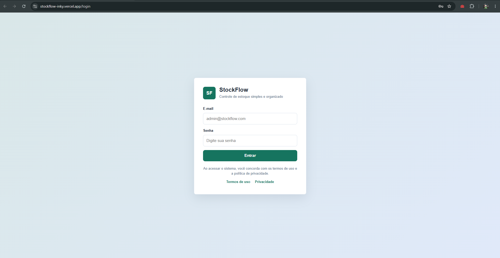
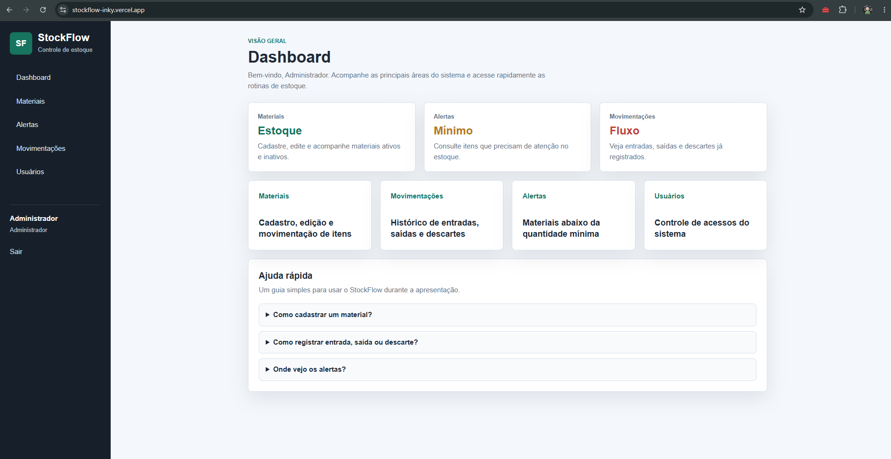
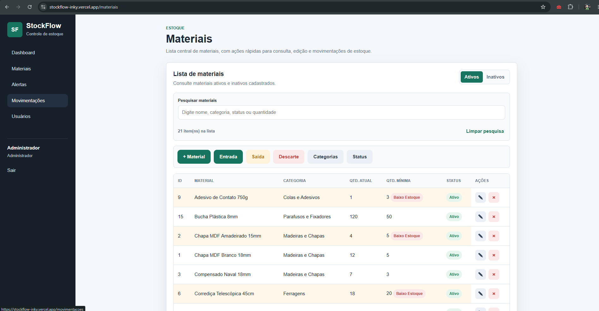
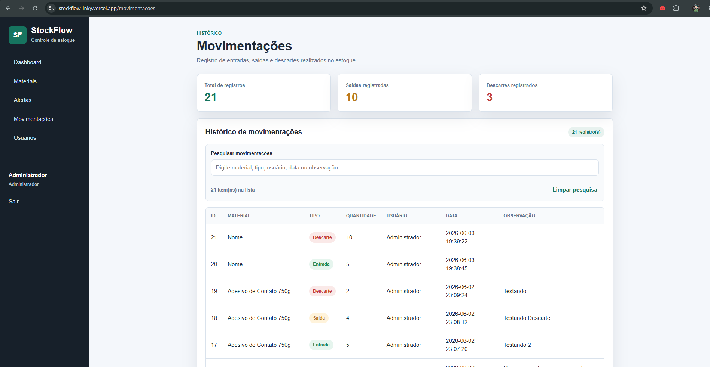

<h1 align="center">📦 StockFlow</h1>

<p align="center">
  Sistema web para controle de estoque, desenvolvido com Python, Flask e MySQL.
</p>

<p align="center">
  
  
  
</p>

---

## ✨ Sobre o projeto

O **StockFlow** é um sistema web de controle de estoque criado para organizar materiais, usuários e movimentações de entrada e saída.

A proposta do projeto é oferecer uma solução simples e funcional para gestão de estoque, permitindo visualizar informações importantes, registrar materiais, acompanhar movimentações e manter os dados organizados em um banco MySQL.

O projeto foi desenvolvido como um MVP, com foco em estruturação de sistema web, organização de rotas, conexão com banco de dados e construção de telas funcionais.

---

## 🎯 Objetivo

Criar um sistema web capaz de auxiliar no controle de estoque, centralizando informações sobre materiais, movimentações e usuários.

Além da proposta funcional, o projeto também teve como objetivo praticar desenvolvimento back-end com Flask, integração com banco de dados MySQL e criação de interfaces web com HTML, CSS e JavaScript.

---

## 🧩 Funcionalidades

* Tela de login
* Dashboard principal
* Cadastro e listagem de materiais
* Controle de movimentações
* Organização de usuários
* Página de alertas
* Integração com banco de dados MySQL
* Separação de rotas por responsabilidade
* Uso de variáveis de ambiente para configurações sensíveis
* Deploy online

---

## 🛠️ Tecnologias utilizadas

<p align="left">
  
</p>

* **Python** — linguagem principal do back-end
* **Flask** — framework utilizado para criação da aplicação web
* **MySQL** — banco de dados relacional
* **HTML5** — estrutura das páginas
* **CSS3** — estilização das interfaces
* **JavaScript** — interações no front-end
* **Git e GitHub** — versionamento e hospedagem do código
* **VS Code** — ambiente de desenvolvimento

---

## 📁 Estrutura do projeto

```text
stockflow/
├── database/
│   └── configuração e conexão com banco de dados
├── models/
│   └── modelos e regras relacionadas aos dados
├── routes/
│   └── rotas da aplicação
├── sql/
│   └── scripts SQL do projeto
├── static/
│   └── arquivos estáticos, como CSS, JavaScript e imagens
├── templates/
│   └── páginas HTML renderizadas pelo Flask
├── .env.example
├── .gitignore
├── app.py
├── config.py
├── decorators.py
├── requirements.txt
├── setup_banco.py
└── README.md
```

### Principais pastas

* `routes/` — rotas de autenticação, dashboard, materiais, movimentações e usuários
* `templates/` — páginas HTML da aplicação
* `static/` — arquivos de estilo, scripts e recursos visuais
* `models/` — estrutura relacionada aos dados do sistema
* `database/` — conexão e configuração do banco
* `sql/` — scripts para criação ou configuração da base de dados

---

## 🚀 Deploy

Acesse o projeto online:

[StockFlow - Deploy](https://stockflow-inky.vercel.app/)

---

## ⚙️ Como executar localmente

### 1. Clone o repositório

```bash
git clone https://github.com/wxpdr/stockflow.git
```

### 2. Acesse a pasta do projeto

```bash
cd stockflow
```

### 3. Instale as dependências

```bash
pip install -r requirements.txt
```

### 4. Configure as variáveis de ambiente

Crie um arquivo `.env` na raiz do projeto com base no arquivo `.env.example`.

Exemplo:

```env
SECRET_KEY=sua_chave_secreta_aqui
DB_HOST=localhost
DB_USER=seu_usuario
DB_PASSWORD=sua_senha
DB_NAME=stockflow
FLASK_DEBUG=1
```

### 5. Execute a aplicação

```bash
python app.py
```

Depois, acesse no navegador:

```text
http://localhost:5000
```

---

## 🔐 Observação de segurança

O arquivo `.env` não deve ser enviado para repositórios públicos.

As informações sensíveis, como chave secreta, usuário, senha e nome do banco, devem ser configuradas localmente ou diretamente nas variáveis de ambiente da hospedagem.

---

## 🖼️ Preview

A demonstração pode ser acessada pelo link do deploy.

Caso queira adicionar capturas futuramente, uma sugestão de estrutura seria:

```md
## 🖼️ Preview

### Login



### Dashboard



### Materiais



### Movimentações


```

---

## 💼 Tipo de projeto

Este é um projeto de sistema web desenvolvido como MVP, com foco em controle de estoque e organização de informações.

Ele representa uma prática mais completa de desenvolvimento, envolvendo back-end, banco de dados, templates HTML, rotas, autenticação e estruturação de aplicação.

---

## 🧠 Aprendizados

Durante o desenvolvimento deste projeto, pratiquei:

* criação de aplicação web com Flask;
* organização de rotas por responsabilidade;
* integração com banco de dados MySQL;
* uso de templates HTML com Flask;
* estruturação de páginas para dashboard e gestão de dados;
* configuração de variáveis de ambiente;
* separação de arquivos e pastas em um projeto web;
* criação de um MVP funcional;
* documentação de um sistema no GitHub.

---

## 👩‍💻 Desenvolvedora

Projeto desenvolvido por **Wendy** 🌸

---

<p align="center">
  Sistema finalizado como MVP, feito com Python, Flask, MySQL e uma boa dose de organização 📦✨
</p>
